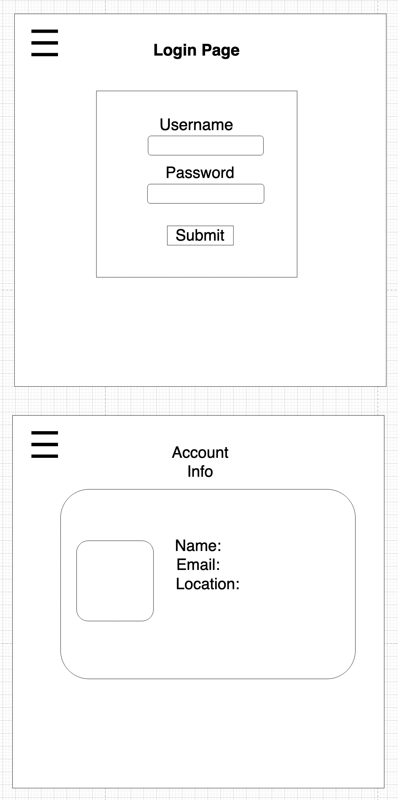
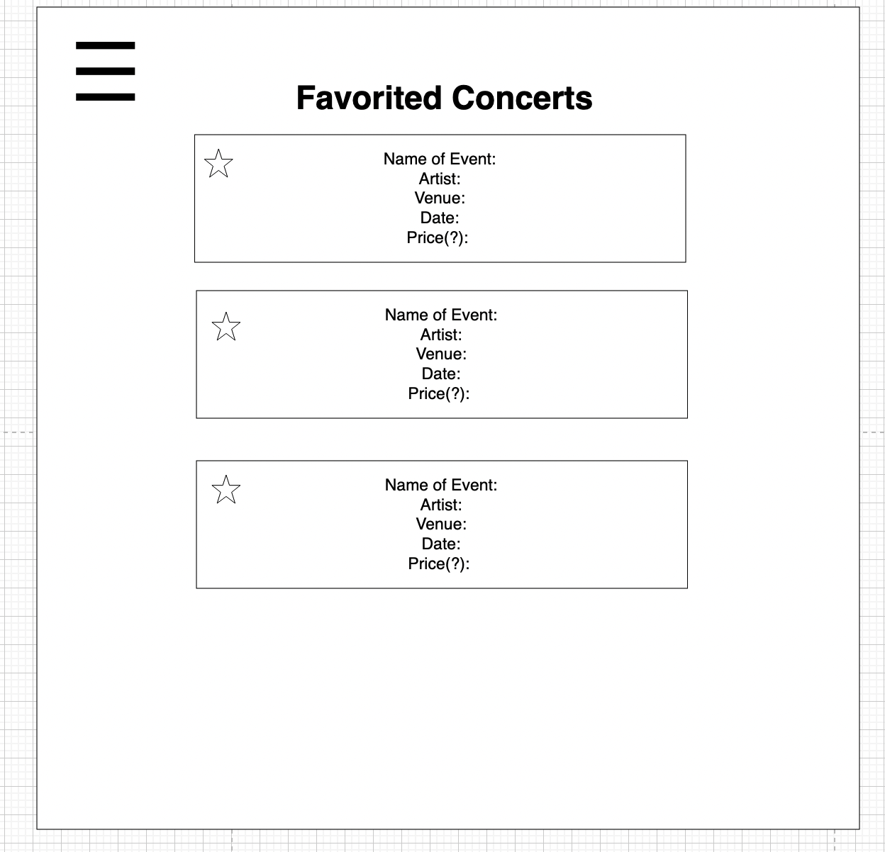
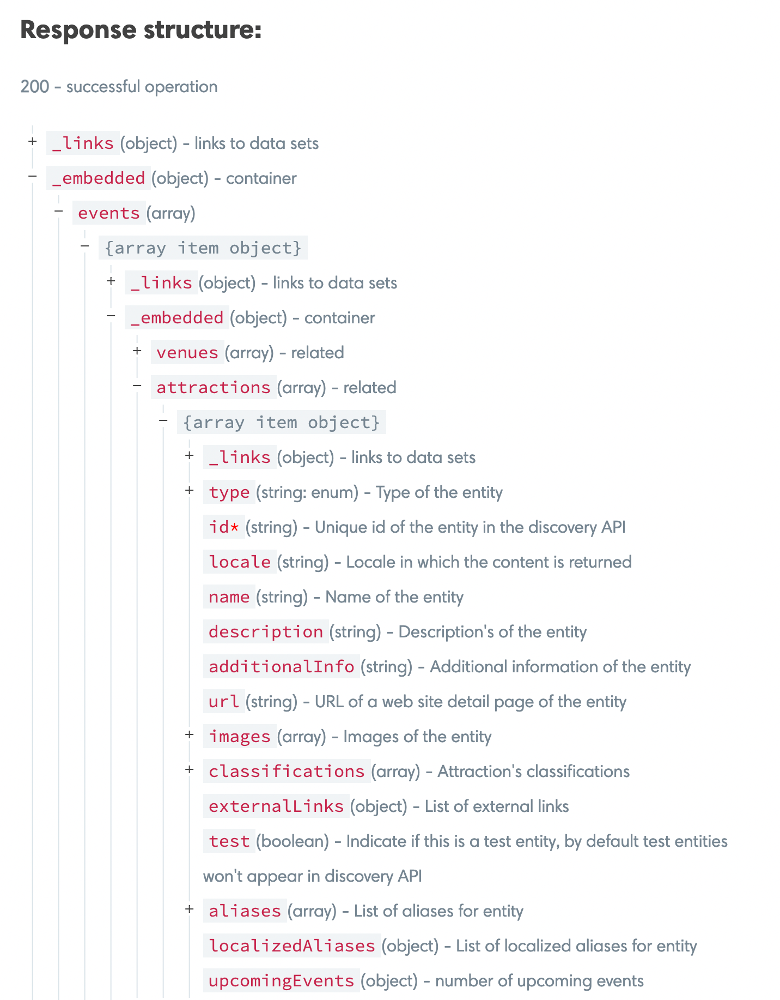
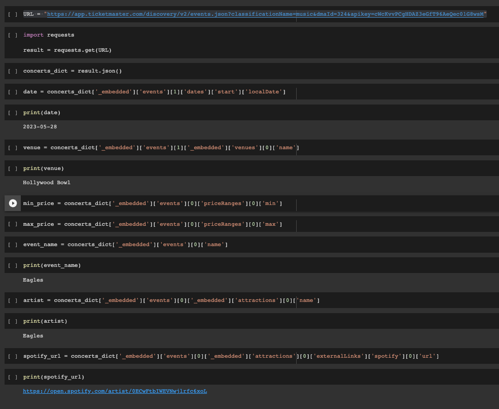

# Concerto

## Group 4 Members
- Esteban Chirinos
- Rachel Johnson
- Nicolette Mabeza
- Jimmy Nguyen

## Design
- [API design](docs/api-design.md)
- [Data Model](docs/data-model.md)
- [GHI](docs/ghi.md)
- [Integrations]

## Getting started - JN

clone the repository
- cd into the new project directory
- docker volume create pg-admin
- docker volume create postgres-data
- docker compose build
- docker compose up

## Design - RJ
Concerto is a full-stack web application for music lovers to search for concerts. It removes the friction between searching for concerts and moving to another application to sample music by an artist, by embedding a Spotify player within the browser window.

Concerts and Users are separate microservices. The microservices communicate via a poller.

## Functionality - JN
- Visitors to the site can search for local entertainment based off whatever location/destination as they please.
- Concerts will

### Wireframes - RJ

## Concerts Microservice - RJ
Users search for concerts in their area on the landing page.

## Users Microservice - RJ
Users can create an account using (what kind of technology).
Users are able to add concerts to their list of favorites.

## Third Party APIS - RJ
Concerto implements two external APIs; Ticketmaster API and Spotify API.

### Tickermaster API - RJ

The concerts microservice uses the ticketmaster API to show a list view of concerts.
For the purposes of Concerto, a request to ticketmaster API contains a location key and event type key.
This is an example request searching for music events in Los Angeles:
https://app.ticketmaster.com/discovery/v2/events.json?classificationName=music&dmaId=324&apikey=btsaKZ8FElrG6RkY7eRLIRvqVfJ9P374

The ticketmaster get request returns a JSON object as detailed below:

### Spotify API - RJ

The Spotify API allows developers to embed a Spotify player into the browser.
The data is passed from the ticketmaster response into the Spotify API request. Using the artist name, the embedded Spotify player will be populated with songs from that artist.

The data flow from Ticketmaster to Spotify is detailed below:

## Deliverables

* [*] Wire-frame diagrams
* [*] API documentation
* [ ] Project is deployed to Render.com/GitLab-pages
* [*] GitLab issue board is setup and in use
* [ ] Journals

## Project layout

The layout of the project is just like all of the projects
you did with `docker-compose` in module #2. You will create
a directory in the root of the repository for each service
that you add to your project just like those previous
projects were setup.

### Directories

Several directories have been added to your project. The
directories `docs` and `journals` are places for you and
your team-mates to, respectively, put any documentation
about your project that you create and to put your
project-journal entries. See the _README.md_ file in each
directory for more info.

The other directories, `ghi` and `sample_service`, are
sample services, that you can start building off of or use
as a reference point.

Inside of `ghi` is a minimal React app that has an "under
construction" page. It is setup similarly to all of the
other React projects that you have worked on.

Inside of `sample_service` is a minimal FastAPI application.
"Where are all the files?" you might ask? Well, the
`main.py` file is the whole thing, and go take look inside
of it... There's not even much in there..., hmm? That is
FastAPI, we'll learn more about it in the coming days. Can
you figure out what this little web-application does even
though you haven't learned about FastAPI yet?

Also in `sample_service` is a directory for your migrations.
If you choose to use PostgreSQL, then you'll want to use
migrations to control your database. Unlike Django, where
migrations were automatically created for you, you'll write
yours by hand using DDL. Don't worry about not knowing what
DDL means; we have you covered. There's a sample migration
in there that creates two tables so you can see what they
look like.

The sample Dockerfile and Dockerfile.dev run your migrations
for you automatically.

### Other files

The following project files have been created as a minimal
starting point. Please follow the guidance for each one for
a most successful project.

* `docker-compose.yaml`: there isn't much in here, just a
  **really** simple UI and FastAPI service. Add services
  (like a database) to this file as you did with previous
  projects in module #2.
* `.gitlab-ci.yml`: This is your "ci/cd" file where you will
  configure automated unit tests, code quality checks, and
  the building and deployment of your production system.
  Currently, all it does is deploy an "under construction"
  page to your production UI on GitLab and a sample backend
  to Render.com. We will learn much more about this file.
* `.gitignore`: This is a file that prevents unwanted files
  from getting added to your repository, files like
  `pyc` files, `__pycache__`, etc. We've set it up so that
  it has a good default configuration for Python projects.

## How to complete the initial deploy

There will be further guidance on completing the initial
deployment, but it just consists of these steps:

### Setup GitLab repo/project

* make sure this project is in a group. If it isn't, stop
  now and move it to a GitLab group
* remove the fork relationship: In GitLab go to:

  Settings -> General -> Advanced -> Remove fork relationship

* add these GitLab CI/CD variables:
  * PUBLIC_URL : this is your gitlab pages URL
  * SAMPLE_SERVICE_API_HOST: enter "blank" for now

#### Your GitLab pages URL

You can't find this in GitLab until after you've done a deploy
but you can figure it out yourself from your GitLab project URL.

If this is your project URL

https://gitlab.com/GROUP_NAME/PROJECT_NAME

then your GitLab pages URL will be

https://GROUP_NAME.gitlab.io/PROJECT_NAME

### Create render.com account and application

* create account on render.com
* one person create a group and invite all other members
* create a new "Web Service"
  * authenticate with GitLab and choose your project
  * Enter fields:
    * Name: name of your service
    * Root Directory: the directory of your service in your git repo.
      For this example use "sample_service".
    * Environment: Docker
    * Plan Type: Free
  * click the "Create Web Service" button to create it
  * the build will succeed and it will look like the server is running,
    most likely, in 6-10 minutes, it will fail.
  * click "Manual Deploy" -> "Deploy latest commit" and the service
    should deploy successfully.

### Update GitLab CI/CD variables

Copy the service URL for your new render.com service and then paste
that into the value for the SAMPLE_SERVICE_API_HOST CI/CD variable
in GitLab.

### Deploy it

Merge a change into main to kick off the initial deploy. Once the build pipeline
finishes you should be able to see an "under construction" page on your GitLab
pages site.
